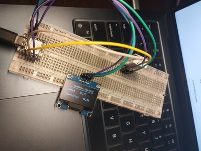

# ESP32 Weather Station

The ESP32 Weather Station is a compact, real-time temperature and humidity monitoring system using the Seeed Studio XIAO ESP32C6. This project integrates a DHT22 (AM2302) sensor to collect environmental data and a GoldenMorning 1.3 Inch I2C OLED Display Module to visualize the readings. The device provides an easy-to-read display and continuously updates with the latest temperature and humidity values.

This project is ideal for IoT applications, smart home automation, and weather tracking. It is simple to set up and provides accurate readings, making it a great tool for learning embedded systems and microcontroller programming.

## Components Used
- **Seeed Studio XIAO ESP32C6**
- **DHT22 Digital Temperature & Humidity Sensor Module (AM2302)**
- **GoldenMorning 1.3 Inch I2C OLED Display Module (4-pin, WHITE)**
- **Jumper Wires**
- **Breadboard (Optional)**

## Wiring Diagram

| Component | ESP32C6 Pin |
|-----------|------------|
| OLED VCC  | 3.3V       |
| OLED GND  | GND        |
| OLED SCK  | GPIO 22    |
| OLED SDA  | GPIO 23    |
| DHT22 Data| GPIO 21    |
| DHT22 VCC | 3.3V       |
| DHT22 GND | GND        |

## Setting Up the ESP32C6
1. Install **Arduino IDE** (or VS Code with PlatformIO)
2. Install **ESP32 Board Package** in the Arduino IDE (Board Manager > Search "ESP32")
3. Install required libraries:
   - `U8g2` (for OLED display)
   - `DHT sensor library`
   - `Adafruit Unified Sensor`
4. Connect the ESP32C6 to your PC via USB and select the correct board & port in the Arduino IDE
5. Upload the code (`src/weather_station.ino`)

## Code Explanation
The code initializes the OLED display and DHT22 sensor, then continuously reads the temperature & humidity, displaying them on the OLED screen. If the sensor fails, an error message appears.

## Expected Output
- OLED displays temperature and humidity values
- Serial Monitor prints the sensor readings

## Troubleshooting
- **Sensor Not Detected?** Check wiring and ensure proper library installation.
- **OLED Not Displaying?** Ensure correct I2C pins are used and try scanning for devices using an I2C scanner sketch.

## Images

## TODO

- **Add MQTT Support for Home Assistant**
  - Integrate MQTT protocol to allow remote monitoring via Home Assistant.
  - Enable real-time data updates for smart home automation.

- **Implement Web Server for WiFi Setup**
  - Develop a simple web interface for configuring WiFi settings.
  - Allow users to connect the ESP32C6 to a network without modifying the code.

## License
This project is open-source under the MIT License.
